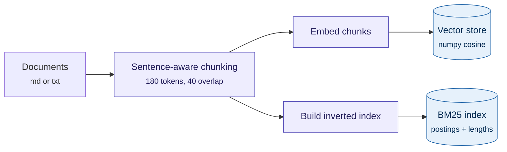
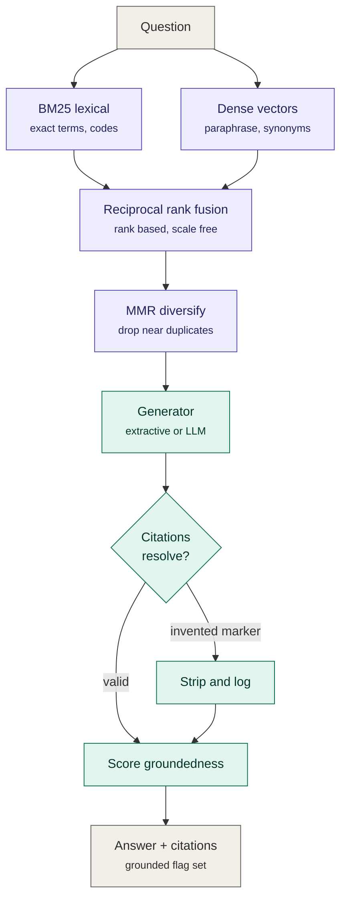
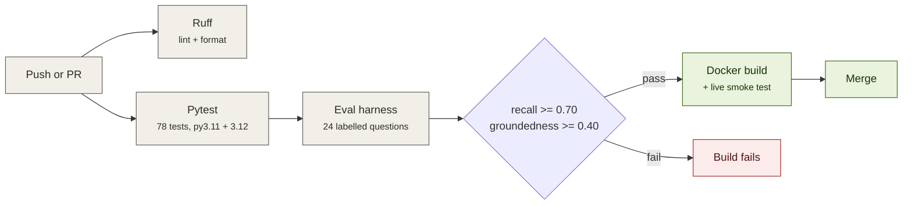
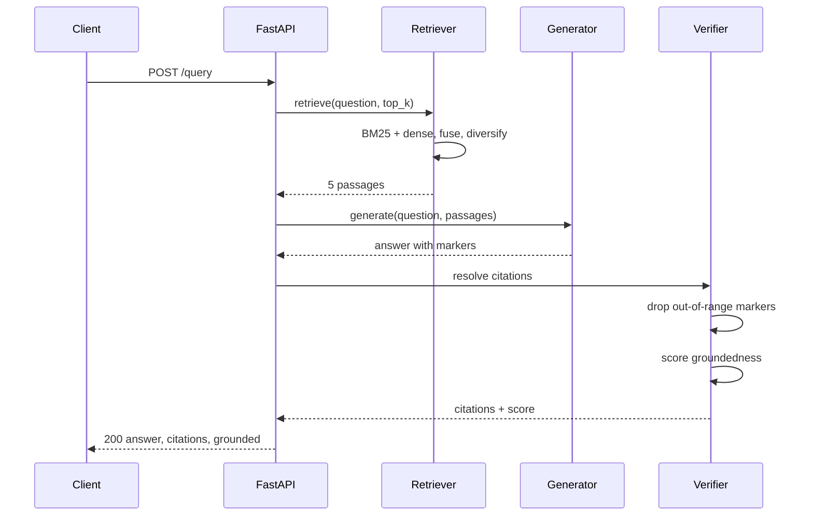

<p align="center">
  
</p>

# Citation-Grounded RAG Service

A retrieval-augmented generation service that will not tell you something without
showing you where it came from — and that measures whether it is actually doing so.

Hybrid retrieval (BM25 + dense) fused with reciprocal rank fusion, MMR
diversification, verified citations, a groundedness gate, and an offline
evaluation harness wired into CI as a regression gate.


---

## Why this exists

Most RAG demos answer questions. The hard part in a regulated setting — healthcare,
finance, legal — is not producing an answer, it is producing an answer a reviewer
can audit, and knowing when the system should decline to answer at all.

This service is built around three properties that a demo usually skips:

1. **Every citation is verified against what was actually retrieved.** If the
   generator emits `[7]` when five passages were supplied, that marker is stripped
   and logged. A fabricated source rendered as a real one is worse than no answer.
2. **Answers carry a groundedness score, and low-scoring answers are flagged**
   rather than silently returned, so a caller can degrade gracefully.
3. **Abstention is a measured behaviour, not an accident.** The eval set contains
   unanswerable questions where refusal is the correct output, and
   `abstention_accuracy` is reported next to `false_abstention_rate` so the
   trade-off between the two is visible.

It runs with **no API key, no model downloads and no vector database**, which
means CI is hermetic and evaluation numbers are reproducible bit-for-bit.
Production providers (sentence-transformers, Anthropic) are one config change away.

## Quick start

```bash
git clone https://github.com/adu3010/rag-citations-service.git
cd rag-citations-service
make dev          # install runtime + dev dependencies
make test         # 78 tests, ~1s
make eval         # evaluation report with regression gates
make serve        # http://localhost:8000/docs
```

Ask it something:

```bash
curl -s -X POST http://localhost:8000/query \
  -H 'Content-Type: application/json' \
  -d '{"question": "What are the four functions of the NIST AI Risk Management Framework?"}' | jq
```

```json
{
  "answer": "The framework is organised into four functions [1]. GOVERN establishes a culture of risk management and cuts across the other three [1].",
  "citations": [
    {
      "marker": 1,
      "chunk_id": "nist-ai-rmf::1",
      "doc_id": "nist-ai-rmf",
      "source": "nist-ai-rmf.md",
      "snippet": "The framework is organised into four functions. GOVERN establishes a culture of risk management..."
    }
  ],
  "groundedness": 1.0,
  "grounded": true,
  "abstained": false,
  "latency_ms": { "retrieval": 0.9, "generation": 0.3, "total": 1.2 }
}
```

Or with Docker:

```bash
docker compose up --build
```

## Architecture

Documents are chunked once at startup and indexed two ways:



A query then hits both indexes in parallel:



## Design decisions

Each of these was a fork in the road; the reasoning matters more than the choice.

**Hybrid retrieval rather than dense-only.** Dense retrieval loses exact
identifiers — SOC codes, drug names, error strings, statute numbers. Those are
precisely the queries users care about most. BM25 has the mirror-image failure
profile, so the two arms cover each other's blind spots.

**Reciprocal rank fusion rather than a weighted score blend.** BM25 scores are
unbounded and corpus-dependent; cosine similarity is bounded in [-1, 1]. Any fixed
`alpha * bm25 + (1 - alpha) * cosine` needs retuning every time the corpus grows
materially. RRF consumes only ranks, so it is scale-free and effectively
tuning-free.

**MMR after fusion.** Overlapping chunks mean the naive top-5 is often five
near-duplicates of one paragraph. In a citation-bearing system that is actively
harmful: duplicate evidence presents as corroboration when it is not.

**Sentence-aware chunking rather than fixed-width.** A chunk that ends mid-clause
cannot be quoted back to a user as evidence, which disqualifies fixed-width
chunking for this use case regardless of its retrieval metrics.

**A deterministic default embedder.** `HashingEmbedder` uses signed feature
hashing over unigrams and bigrams with `blake2b` — not Python's builtin `hash()`,
which is salted per process and would make a persisted index unreadable after a
restart. This keeps CI hermetic and evaluation reproducible. Swap to
sentence-transformers with `RAG_EMBEDDER=sentence-transformer`.

**A flat numpy store rather than a vector database.** Exact cosine search over a
contiguous matrix beats a network round-trip to a vector DB up to roughly 10^5
chunks, and removes an entire piece of infrastructure from the deployment. The
interface is four methods, so a FAISS or pgvector swap is contained.

**`/readyz` separate from `/healthz`.** The process can be alive while the index
is still building. Kubernetes needs to tell those apart or it will route traffic
into a service that cannot serve it.

## Evaluation

The harness is the reason this repo exists rather than a notebook. Retrieval and
generation are scored separately because their failure modes have different fixes:
if the retriever never surfaces the supporting passage, no amount of prompt
engineering will save the answer.

```bash
make eval        # writes evals/results/report.md and report.json
```

Results on the bundled 6-document corpus, 24 labelled questions (2 unanswerable),
`hashing-512` embedder + `extractive` generator:

| metric | value | what it tells you |
| --- | --- | --- |
| recall@5 | 1.000 | the supporting document reaches the top 5 every time |
| precision@5 | 0.287 | expected — most questions have exactly one relevant document out of five slots |
| MRR | 0.947 | the right document is almost always ranked first |
| nDCG@5 | 0.961 | ranking quality, log-discounted |
| keyword_coverage | 0.841 | fraction of expected facts present in the answer |
| citation_precision | 0.795 | **fraction of cited documents that are genuinely relevant — see Limitations** |
| groundedness | 1.000 | lexical support of each sentence against its cited passage |
| abstention_accuracy | 1.000 | unanswerable questions correctly refused |
| false_abstention_rate | 0.000 | answerable questions wrongly refused |
| latency p50 / p95 | 0.87 ms / 1.27 ms | end-to-end, in-process |

CI fails the build if recall drops below 0.70 or groundedness below 0.40. The
thresholds sit deliberately below the committed baseline: the gate exists to catch
drift and regressions, not to enforce an exact number.

Every quality metric above is reproducible bit-for-bit on any machine, because the
default embedder and generator are both deterministic. Only latency varies with
hardware.



## Limitations

Stated plainly, because a repo whose metrics are all 1.000 tells a reviewer nothing.

**`citation_precision` is 0.795, and the failure is diagnosable.** Ask *"How many
controls are in Annex A of ISO 42001?"* and the extractive baseline cites the wrong
document. The cause is that coverage weights every query term equally: a sentence
matching `{many, iso, 42001}` scores 3/5 while the sentence that actually answers
the question, matching `{annex, controls}`, scores 2/5. The fix is IDF-weighted
coverage using the statistics already sitting in the BM25 index. It is not
implemented yet; it is the next change.

**`groundedness` of 1.000 is not as impressive as it looks.** The extractive
generator quotes retrieved sentences verbatim, so lexical-overlap groundedness is
trivially perfect. The metric earns its keep only against an LLM generator, where
paraphrase is real. The score is also a *lexical* proxy: it cannot detect a fluent
paraphrase that inverts its source's meaning. Catching that needs model-graded
evaluation, calibrated against a human-labelled subset, using a different model
from the one under test to avoid self-preference bias.

**recall@5 of 1.000 reflects an easy corpus.** Six documents and sixteen chunks is
a smoke test, not a benchmark. These numbers demonstrate that the harness works;
they say little about retrieval quality at scale.

**The abstention threshold is blunt.** `min_coverage=0.3` was calibrated against
this eval set. It is a single global number where a rarity-weighted, query-length-aware
threshold would be better.

**No reranker.** A cross-encoder reranking stage over the fused candidate pool is
the standard next quality win and the natural place to spend the next increment of
latency budget.

## API

| method | path | purpose |
| --- | --- | --- |
| `POST` | `/query` | answer a question with verified citations |
| `POST` | `/ingest` | add documents to the live index |
| `GET` | `/healthz` | liveness — is the process up |
| `GET` | `/readyz` | readiness — is the index built |
| `GET` | `/stats` | index size, active config, request counters |
| `GET` | `/metrics` | Prometheus exposition format |
| `GET` | `/docs` | OpenAPI UI |

What a single `/query` call actually does:



## Configuration

Every knob is an environment variable; see [`.env.example`](.env.example) for the
full list with defaults. The ones that change behaviour most:

| variable | default | effect |
| --- | --- | --- |
| `RAG_EMBEDDER` | `hashing` | `hashing` (offline, deterministic) or `sentence-transformer` |
| `RAG_GENERATOR` | `extractive` | `extractive` (offline, deterministic) or `anthropic` |
| `RAG_CHUNK_TOKENS` | `180` | chunk size budget in tokens |
| `RAG_TOP_K` | `5` | passages passed to the generator |
| `RAG_RRF_K` | `60` | reciprocal rank fusion constant |
| `RAG_MMR_LAMBDA` | `0.7` | relevance/diversity trade-off; `1.0` disables MMR |
| `RAG_MIN_GROUNDEDNESS` | `0.25` | below this, an answer is flagged `grounded: false` |

To run against a real LLM and real embeddings:

```bash
pip install -e '.[dense,llm]'
export ANTHROPIC_API_KEY=sk-...
RAG_EMBEDDER=sentence-transformer RAG_GENERATOR=anthropic make serve
```

## Project layout

```
src/rag/
├── text.py          tokenisation and sentence splitting (shared by both retrievers)
├── chunking.py      sentence-aware chunking with overlap
├── embeddings.py    Embedder Protocol: hashing | sentence-transformer
├── bm25.py          Okapi BM25 inverted index
├── store.py         numpy vector store with persistence
├── retriever.py     RRF fusion + MMR diversification
├── generation.py    Generator Protocol: extractive | anthropic
├── pipeline.py      orchestration, citation verification, groundedness
├── api.py           FastAPI service
└── eval/
    ├── metrics.py   recall, precision, MRR, nDCG, coverage, citation precision
    └── runner.py    harness CLI with --fail-under-* regression gates
```

## Testing

```bash
make test    # 78 tests
make lint    # ruff check + format check
```

The suite tests behaviour, not implementation: metrics are verified against
hand-worked examples, chunking is asserted never to split a sentence, MMR is
asserted to actually displace a near-duplicate, and hallucinated citation markers
are asserted to be stripped.

It has already earned its keep. It caught a correctness bug where interrogatives
("what", "how", "which") were being treated as content terms — so
*"What is the best pizza in Naples?"* matched any passage containing the word
"what", and the service confidently answered an out-of-domain question instead of
abstaining. Fixing it required both a stop-list change and the introduction of the
abstention threshold.

## Licence

MIT — see [LICENSE](LICENSE).
